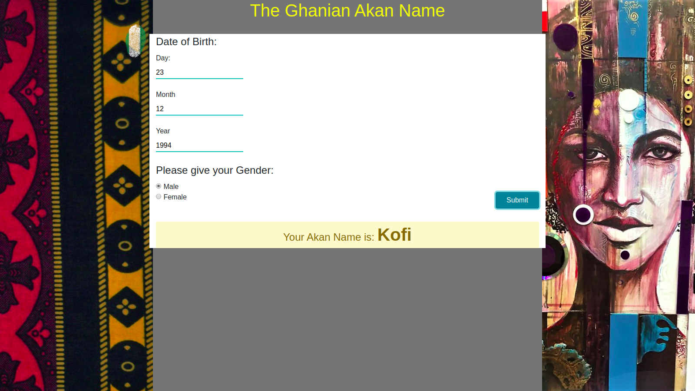
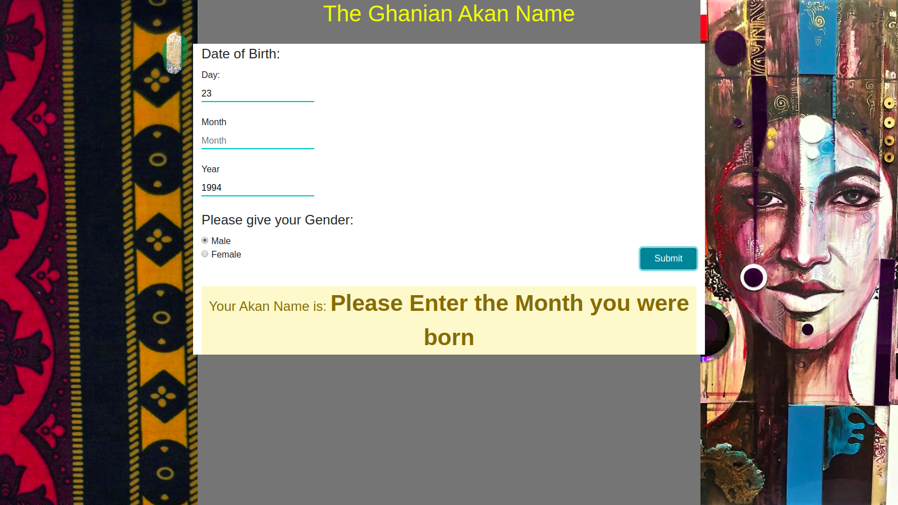

# Ghanian Akan Name App
#### Ghanian Culture, 22nd Sept, 2019
#### By **Wilbrone**
## Description
Gives the users their Akan name depending on their day of birth and gender.

## Technologies Used
the system uses Html and Java Script

## BDD
The system assigns Ghanian cultural names to the user. The names are assigned depending on the day of week, they were born & their gender.
the system takes the date given and retries the day.

The user enters the fields given that the fields are filled correctly the name will be assigned to them.
When the fields ar not correctly field in there will be an error message
but if all the fields are filled correctly and the gender is provided then the name assignes to them will be printed out.

this is what should appear if all is okay

## Support and contact details
wilbroneokoth@gmail.com
### License
*MIT License*
Copyright (c) 2019 **Wilbrone Baron**
